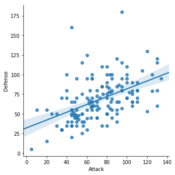
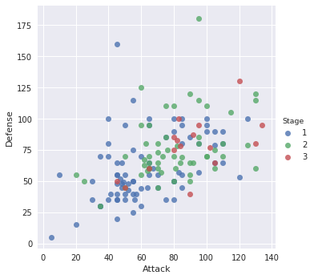
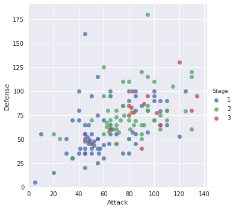
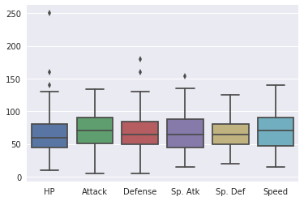
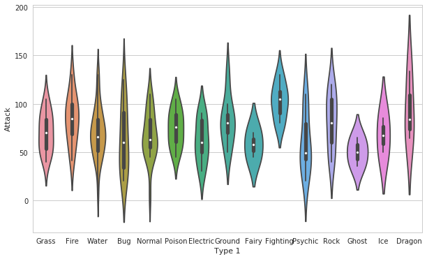
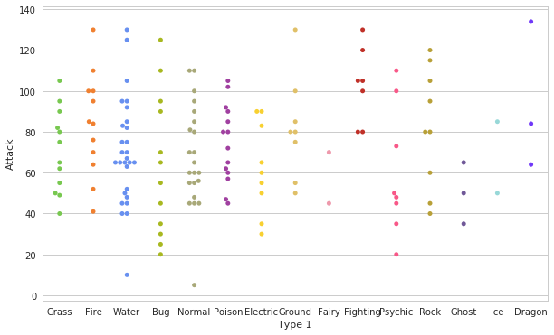
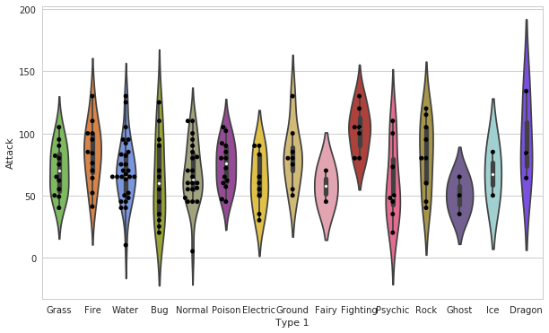
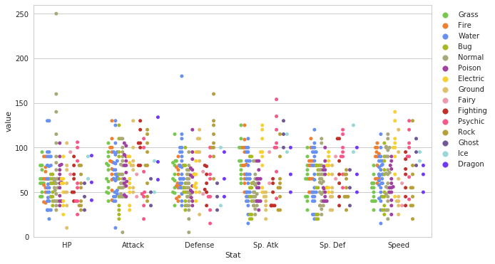
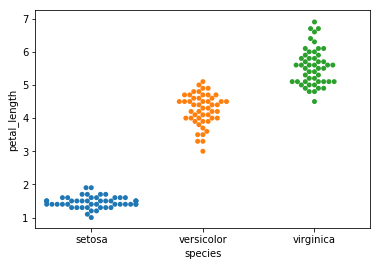
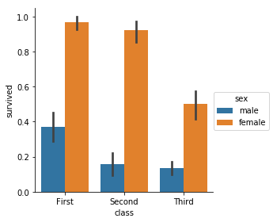

```python
%matplotlib inline
import pandas as pd
from matplotlib import pyplot as plt
import seaborn as sns
```


```python
pokemon = pd.read_csv('../../csv/Pokemon.csv', index_col=0, encoding='latin1')
pokemon.info()
pokemon.head()
```

    <class 'pandas.core.frame.DataFrame'>
    Int64Index: 151 entries, 1 to 151
    Data columns (total 12 columns):
    Name         151 non-null object
    Type 1       151 non-null object
    Type 2       67 non-null object
    Total        151 non-null int64
    HP           151 non-null int64
    Attack       151 non-null int64
    Defense      151 non-null int64
    Sp. Atk      151 non-null int64
    Sp. Def      151 non-null int64
    Speed        151 non-null int64
    Stage        151 non-null int64
    Legendary    151 non-null bool
    dtypes: bool(1), int64(8), object(3)
    memory usage: 14.3+ KB


<div>
<style>
    .dataframe thead tr:only-child th {
        text-align: right;
    }

    .dataframe thead th {
        text-align: left;
    }

    .dataframe tbody tr th {
        vertical-align: top;
    }
</style>
<table border="1" class="dataframe">
  <thead>
    <tr style="text-align: right;">
      <th></th>
      <th>Name</th>
      <th>Type 1</th>
      <th>Type 2</th>
      <th>Total</th>
      <th>HP</th>
      <th>Attack</th>
      <th>Defense</th>
      <th>Sp. Atk</th>
      <th>Sp. Def</th>
      <th>Speed</th>
      <th>Stage</th>
      <th>Legendary</th>
    </tr>
    <tr>
      <th>#</th>
      <th></th>
      <th></th>
      <th></th>
      <th></th>
      <th></th>
      <th></th>
      <th></th>
      <th></th>
      <th></th>
      <th></th>
      <th></th>
      <th></th>
    </tr>
  </thead>
  <tbody>
    <tr>
      <th>1</th>
      <td>Bulbasaur</td>
      <td>Grass</td>
      <td>Poison</td>
      <td>318</td>
      <td>45</td>
      <td>49</td>
      <td>49</td>
      <td>65</td>
      <td>65</td>
      <td>45</td>
      <td>1</td>
      <td>False</td>
    </tr>
    <tr>
      <th>2</th>
      <td>Ivysaur</td>
      <td>Grass</td>
      <td>Poison</td>
      <td>405</td>
      <td>60</td>
      <td>62</td>
      <td>63</td>
      <td>80</td>
      <td>80</td>
      <td>60</td>
      <td>2</td>
      <td>False</td>
    </tr>
    <tr>
      <th>3</th>
      <td>Venusaur</td>
      <td>Grass</td>
      <td>Poison</td>
      <td>525</td>
      <td>80</td>
      <td>82</td>
      <td>83</td>
      <td>100</td>
      <td>100</td>
      <td>80</td>
      <td>3</td>
      <td>False</td>
    </tr>
    <tr>
      <th>4</th>
      <td>Charmander</td>
      <td>Fire</td>
      <td>NaN</td>
      <td>309</td>
      <td>39</td>
      <td>52</td>
      <td>43</td>
      <td>60</td>
      <td>50</td>
      <td>65</td>
      <td>1</td>
      <td>False</td>
    </tr>
    <tr>
      <th>5</th>
      <td>Charmeleon</td>
      <td>Fire</td>
      <td>NaN</td>
      <td>405</td>
      <td>58</td>
      <td>64</td>
      <td>58</td>
      <td>80</td>
      <td>65</td>
      <td>80</td>
      <td>2</td>
      <td>False</td>
    </tr>
  </tbody>
</table>
</div>


```python
# Scatter plot
sns.lmplot(x='Attack', y='Defense', data=pokemon)

```


    <seaborn.axisgrid.FacetGrid at 0x7f24a92ce3c8>





```python
# This hue argument is very useful because it allows you to express a third dimension of information using color.
sns.lmplot(x='Attack', y='Defense', data=pokemon, 
           fit_reg=False, # No regression line
           hue='Stage') # Color by evolution stage


```


    <seaborn.axisgrid.FacetGrid at 0x7f24a715fc88>





```python
sns.lmplot(x='Attack', y='Defense', data=pokemon, 
           fit_reg=False, # No regression line
           hue='Stage') # Color by evolution stage
# Tweaking using matplotlib
plt.xlim(0,None)
plt.ylim(0,None)
```


    (0, 190.75138631325481)





```python
# Default boxplot using all columns. Preformat your dataframe to boxplot selective columns

sns.boxplot(data=pokemon.drop(['Total','Stage','Legendary'], axis=1))

```


    <matplotlib.axes._subplots.AxesSubplot at 0x7f24a6a613c8>





```python
# Setting theme
sns.set_style('whitegrid')

fig,ax = plt.subplots(figsize=(10,6))


# Violinplot
sns.violinplot(x="Type 1", y="Attack", data=pokemon)

```


    <matplotlib.axes._subplots.AxesSubplot at 0x7f24a45aeeb8>





```python
pkmn_type_colors = ['#78C850',  # Grass
                    '#F08030',  # Fire
                    '#6890F0',  # Water
                    '#A8B820',  # Bug
                    '#A8A878',  # Normal
                    '#A040A0',  # Poison
                    '#F8D030',  # Electric
                    '#E0C068',  # Ground
                    '#EE99AC',  # Fairy
                    '#C03028',  # Fighting
                    '#F85888',  # Psychic
                    '#B8A038',  # Rock
                    '#705898',  # Ghost
                    '#98D8D8',  # Ice
                    '#7038F8',  # Dragon
                   ]
```


```python
# Swarm plot
plt.subplots(figsize=(10,6))
sns.swarmplot(x='Type 1', y='Attack', palette=pkmn_type_colors, data=pokemon)
```


    <matplotlib.axes._subplots.AxesSubplot at 0x7f24a44162b0>





```python
# Overlaying violinplot with swarmplot

plt.subplots(figsize=(10,6))
sns.violinplot(x='Type 1', y='Attack', palette=pkmn_type_colors, data=pokemon)
sns.swarmplot(x='Type 1', y='Attack', color='k', data=pokemon)

```


    <matplotlib.axes._subplots.AxesSubplot at 0x7f24a61b0f98>





```python
melted_pokemon = pd.melt(pokemon.drop(['Total','Stage','Legendary'], axis=1), 
                         id_vars=['Name','Type 1','Type 2'], # Variables to keep
                         var_name=['Stat']) # Name of melted variable
melted_pokemon.head(), melted_pokemon.shape
```


    (         Name Type 1  Type 2 Stat  value
     0   Bulbasaur  Grass  Poison   HP     45
     1     Ivysaur  Grass  Poison   HP     60
     2    Venusaur  Grass  Poison   HP     80
     3  Charmander   Fire     NaN   HP     39
     4  Charmeleon   Fire     NaN   HP     58, (906, 5))


```python
plt.subplots(figsize=(10,6))
sns.swarmplot(x='Stat', y='value', data=melted_pokemon, hue = 'Type 1',
             dodge=True, # Separate poitns by hue
             palette=pkmn_type_colors) #use pokemon paletter,
    
plt.legend(bbox_to_anchor=(1, 1), loc=2)
plt.ylim(0,260)

```


    (0, 260)





```python
# Various other types of plot like : Heatmap, bargraph, histogram, factorplot
```


```python
# https://www.datacamp.com/community/tutorials/seaborn-python-tutorial#sm

iris = sns.load_dataset('iris')
sns.swarmplot(x='species', y='petal_length', data=iris)
plt.show()

```





```python
titanic = sns.load_dataset('titanic')
sns.factorplot('class','survived','sex',legend=True, palette=None, data=titanic, kind='bar')
plt.show()
```





```python
# Check the available styles
plt.style.available
```


    ['seaborn-bright',
     'grayscale',
     'ggplot',
     'dark_background',
     'seaborn-muted',
     'classic',
     'seaborn-dark-palette',
     'seaborn-deep',
     'seaborn-pastel',
     'seaborn-darkgrid',
     'seaborn-dark',
     '_classic_test',
     'seaborn-colorblind',
     'bmh',
     'seaborn-talk',
     'fivethirtyeight',
     'seaborn-poster',
     'seaborn',
     'seaborn-paper',
     'seaborn-ticks',
     'seaborn-whitegrid',
     'seaborn-white',
     'seaborn-notebook']


